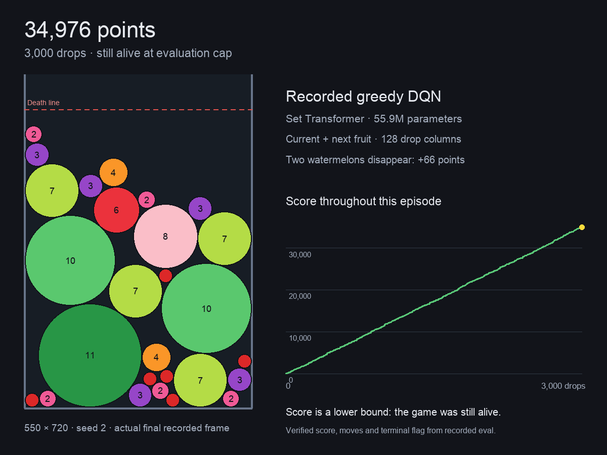
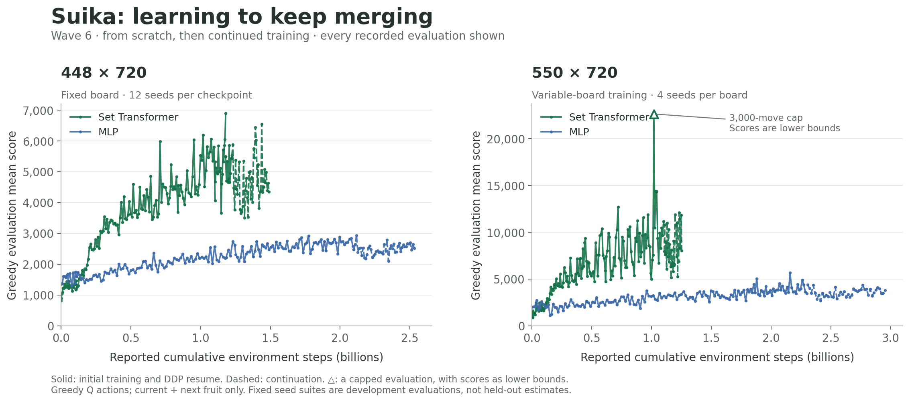
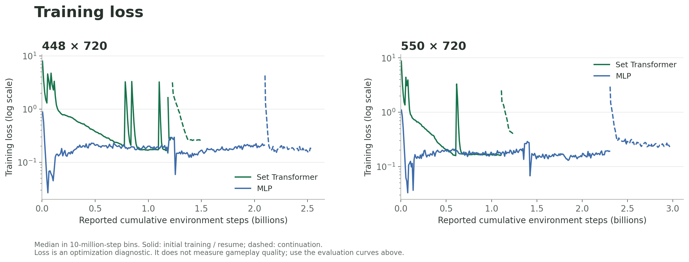

# 合成大西瓜 · Suika RL

用强化学习学会持续合成水果。**55.9M 参数的 Set Transformer + Dueling DQN** 从当前局面与下一个水果预测 128 个落点的 Q 值，部署时直接贪心落子。

**[观看纪录回放与训练曲线](https://guoshaoyang-pku.github.io/blogs/suika_showcase.html)** · [打开逐帧回放](https://guoshaoyang-pku.github.io/blogs/suika/web/index.html) · [训练代码](suika/rl) · [物理引擎](suika/engine)

## 纪录回放

| 对局 | 棋盘 · seed | 分数 | 落子数 | 结束状态 |
|---|---|---:|---:|---|
| [完整纪录局](https://guoshaoyang-pku.github.io/blogs/suika/web/index.html?game=w6s_var550_s1_31447) | 550×720 · 1 | **31,447** | 2,683 | 自然结束 |
| [评测上限时仍存活](https://guoshaoyang-pku.github.io/blogs/suika/web/index.html?game=w6s_var550_s2_34976_capped) | 550×720 · 2 | **≥34,976** | 3,000 | 被评测上限截断，分数为下界 |
| [448 宽板纪录局](https://guoshaoyang-pku.github.io/blogs/suika/web/index.html?game=w6c_h720_s3_26406) | 448×720 · 3 | **26,406** | 2,336 | 自然结束 |
| [完整 Q128 回放](https://guoshaoyang-pku.github.io/blogs/suika/web/index.html?game=w6s_var550_s22_high&tab=pv) | 550×720 · 22 | **22,661** | 2,013 | 自然结束，保存每步 128 列 Q 值 |

[](https://guoshaoyang-pku.github.io/blogs/suika/web/index.html?game=w6s_var550_s2_34976_capped&frame=99999999)

回放支持播放、逐帧、倍速、拖动时间轴和跳到任意落子，显示实际水果位置、落点、分数与合成事件。新纪录从已记录动作重建并校验比分，未保存的 Q 值留空；22,661 分对局可查看完整 Q128。

精彩片段：[一次连锁 +310 分](https://guoshaoyang-pku.github.io/blogs/suika/web/index.html?game=w6s_var550_s1_31447&frame=41499) · [双西瓜消除](https://guoshaoyang-pku.github.io/blogs/suika/web/index.html?game=w6s_var550_s1_31447&frame=41525) · [窄板连锁 +294 分](https://guoshaoyang-pku.github.io/blogs/suika/web/index.html?game=w6c_h720_s3_26406&frame=35757)。

精选单局用于展示行为。550 与 448 是不同棋盘宽度；720 指死亡线到地板的距离。Wave6 使用 **pymunk settle 步进、双西瓜消除并加 66 分**，观察包含当前与下一个水果，未使用未来随机种子或搜索。

## 训练曲线



横轴为日志报告的累计环境步数；实线为初始训练与接续，虚线为后续训练。保留全部评测点，三角标出包含达到评测步数上限的对局；这些分数为下界。模型规模和配方不同，图展示各自实测表现。

| Set Transformer 最佳未截断开发评测 | 局数 | 平均分 | 中位数 |
|---|---:|---:|---:|
| 448×720 · w6s_h720 · grad 12712 | 12 | **6,898.75** | 4,973.5 |
| 550×720 · w6s_var · grad 14893 | 4 | **14,422.25** | 13,566.5 |

评测使用训练期间反复检查的固定开发种子：448×720 为 seed 0–11；550×720 为 seed 0–3。表中按均值选择最佳 checkpoint。后续训练的最后一次均值分别为 4,348.75 与 8,033.0；完整走势见图。



Loss 按每 1,000 万环境步取记录中位数，用于检查优化过程。游戏表现由评测曲线体现。

[回放证据与校验值](suika/showcase/traces/provenance.json) · [精选原始动作](suika/showcase/traces/selected_eval_actions.jsonl)

[评测 CSV](suika/showcase/training/evaluation_curves.csv) · [Loss CSV](suika/showcase/training/loss_curves.csv) · [来源、评测协议与 SHA256](suika/showcase/training/provenance.json) · [曲线 SVG](suika/showcase/training/training_curves.svg)

## 代码与数据

| 路径 | 内容 |
|---|---|
| [suika/rl](suika/rl) | DQN learner、并行 actors、推理服务、固定种子 evaluator、配置与诊断脚本 |
| [suika/engine](suika/engine) | pygame / pymunk 物理引擎、headless 环境与水果规则 |
| [suika/showcase](suika/showcase) | 回放网页、精选压缩 trace、训练图与 CSV |
| [examples/suika_trials](examples/suika_trials) | 试验登记与历史训练评测日志 |
| [suika/docs](suika/docs) | RL 设计、实验记录与基线诊断 |

本地观看已发布回放，在仓库根目录运行：

```bash
python3 -m http.server 8791 --bind 127.0.0.1
```

打开 <http://127.0.0.1:8791/suika/showcase/web/index.html>。回放直接读取保存的 JSON.gz，不需要 GPU 或模型权重。Chrome、Edge、Safari 的当前版本均支持浏览器内 gzip 解压。

训练环境需要 PyTorch、NumPy、PyYAML、pygame 与 pymunk 6.x。节点路径和部署配置在 [suika/rl/configs](suika/rl/configs) 中；训练和评测通过 [env.py](suika/rl/env.py) 使用同一环境。

## 来源

物理引擎基于 [Ole-Batting/suika](https://github.com/Ole-Batting/suika)（MIT），本项目增加训练、评测、规则支持与可视化。保留引擎目录的原始署名和许可。仓库许可见 [LICENSE](LICENSE)。

成果与公开数据更新于 **2026-10-05**。
